#  Attendify Architecture Diagrams

## Enterprise Architecture Documentation for a Cloud-Native Secure SaaS Platform

This document describes the technical architecture of **Attendify**, a secure, distributed, cloud-native SaaS backend system designed for company identity management, secure authentication, edge-based routing, cryptographic request verification, replay protection, and multi-tenant isolation.

---

# 1. Architecture Goals

Attendify is designed around the following architectural goals:

- Provide a secure identity and routing layer for companies.
- Keep employee data ownership outside the central Attendify backend.
- Protect the core backend behind an edge gateway.
- Apply Zero-Trust principles to all external requests.
- Support cryptographic request verification using HMAC, Nonce, and replay prevention.
- Enable horizontal scalability using stateless backend services.
- Provide production-grade observability through logs, metrics, traces, and audit events.

---

# 2. High-Level System Architecture

The following diagram shows the primary runtime flow from a mobile client to the database layer.

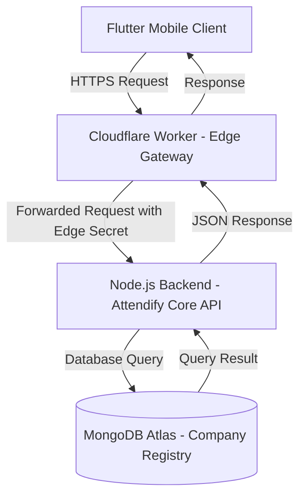

## Explanation

The system is structured as an edge-mediated backend architecture.  
The client never communicates directly with the core backend for operational API calls. Instead, all traffic is routed through the Cloudflare Worker, which acts as an edge security gateway.

The backend is responsible for authentication, authorization, company routing, nonce issuance, cryptographic verification, and interaction with MongoDB Atlas.

---

# 3. C4 Model - Level 1: System Context Diagram

The C4 Context Diagram shows Attendify as a system within its external environment.

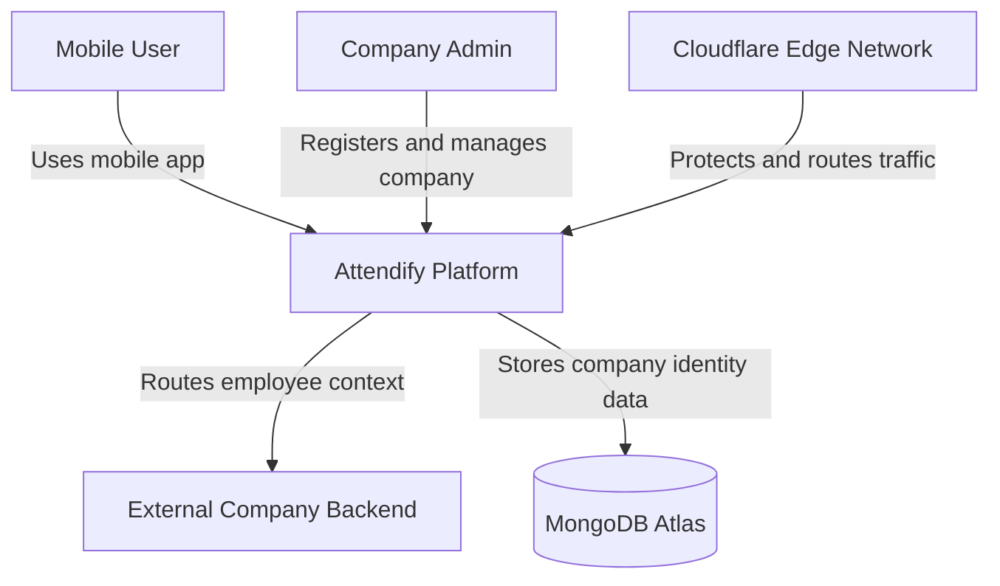

## Explanation

At the highest level, Attendify acts as a secure platform for:

- Company registration.
- Company authentication.
- Secure routing between employees and company systems.
- Cryptographic request verification.
- Company identity storage.

Attendify does not act as the owner of employee business data. Instead, company-specific employee data remains under the control of each external company backend.

---

# 4. C4 Model - Level 2: Container Diagram

The Container Diagram breaks the system into deployable runtime units.

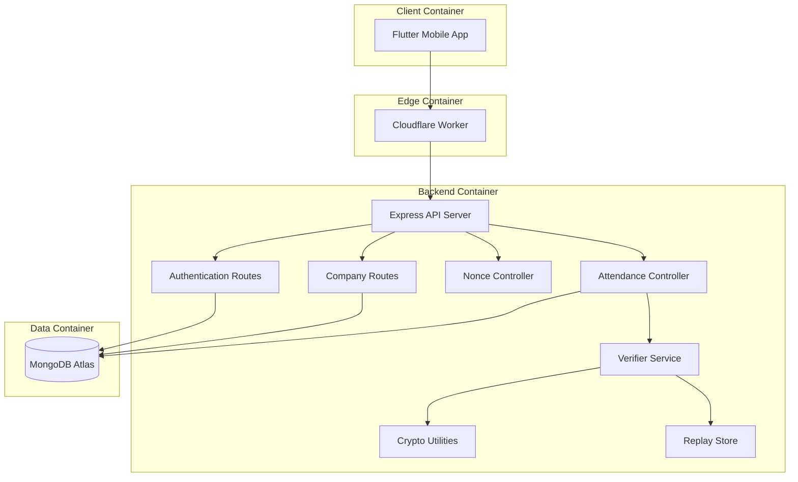

## Explanation

The system is divided into four primary containers:

1. **Flutter Mobile App**  
   Responsible for user interaction, request preparation, nonce usage, and signed attendance submission.

2. **Cloudflare Worker**  
   Responsible for edge routing, gateway protection, secret injection, and resilience handling.

3. **Express Backend**  
   Responsible for authentication, company operations, nonce issuance, and secure attendance validation.

4. **MongoDB Atlas**  
   Responsible for persistent company identity storage and future audit/event records.

---

# 5. C4 Model - Level 3: Backend Component Diagram

This diagram focuses on the internal structure of the Node.js backend.

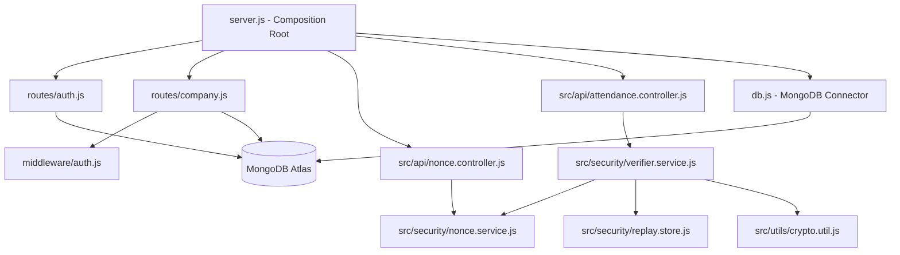

## Explanation

The backend follows a modular architecture:

- `server.js` acts as the composition root.
- `routes/auth.js` handles registration and login.
- `routes/company.js` handles protected company operations.
- `middleware/auth.js` validates JWT tokens.
- `nonce.controller.js` issues nonce values.
- `attendance.controller.js` receives signed attendance requests.
- `verifier.service.js` orchestrates signature, nonce, and replay checks.
- `crypto.util.js` provides hashing, signing, verification, randomness, and canonicalization.
- `replay.store.js` prevents reuse of nonce values.

---

# 6. Zero-Trust Security Architecture

The following diagram describes the Zero-Trust validation pipeline.

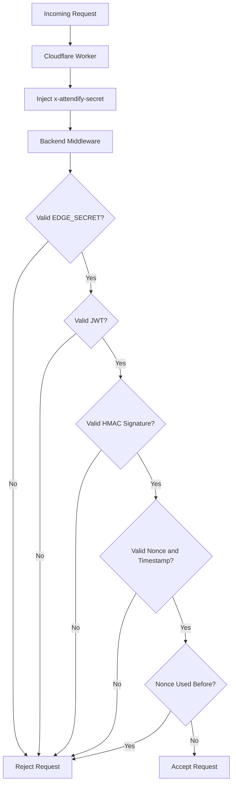

## Explanation

The backend uses a deny-by-default model.  
A request is accepted only after passing multiple independent checks:

1. Edge secret validation.
2. JWT validation.
3. HMAC signature validation.
4. Nonce freshness validation.
5. Replay protection.

This layered security model reduces the probability that a single failure compromises the entire system.

---

# 7. Authentication Flow

This diagram describes how a company authenticates and receives a JWT.

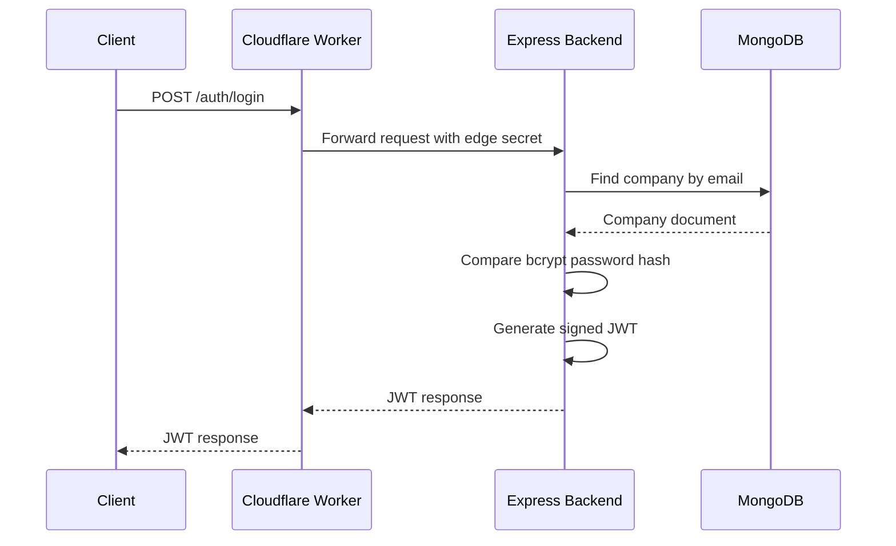

## Explanation

Authentication is stateless.  
After successful login, the backend returns a signed JWT.  
The client uses this token in the `Authorization` header for protected routes.

---

# 8. Company Registration Flow

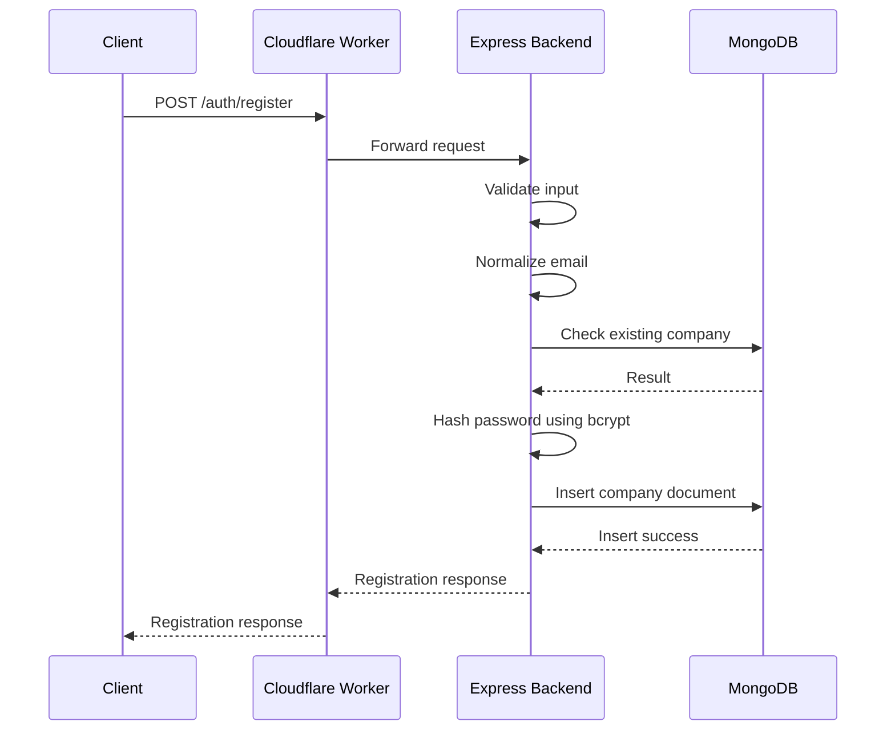

## Explanation

The registration flow protects passwords through one-way hashing.  
The database stores hashed passwords, not plaintext passwords.

---

# 9. Secure Attendance Flow

The attendance flow uses nonce-based freshness and HMAC-based payload integrity.

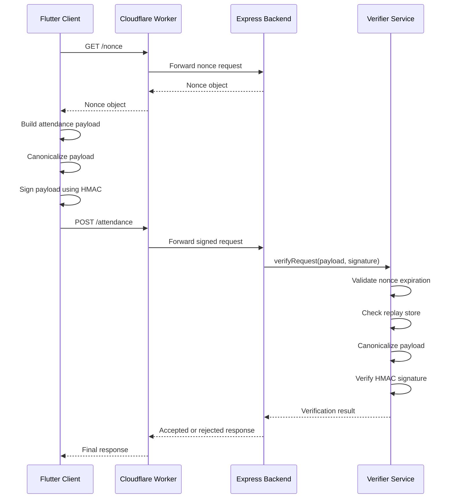

## Explanation

This flow prevents:

- Payload tampering.
- Replay attacks.
- Delayed request injection.
- Unauthorized attendance submission.

---

# 10. Cryptographic Verification Pipeline

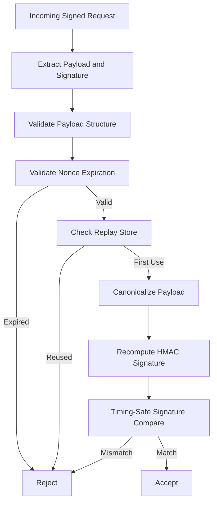

## Explanation

The backend canonicalizes the received payload before signature verification.  
This ensures that both client and server compute the signature over the same deterministic representation.

The signature comparison uses timing-safe comparison to reduce timing attack risk.

---

# 11. Multi-Tenant Isolation Model

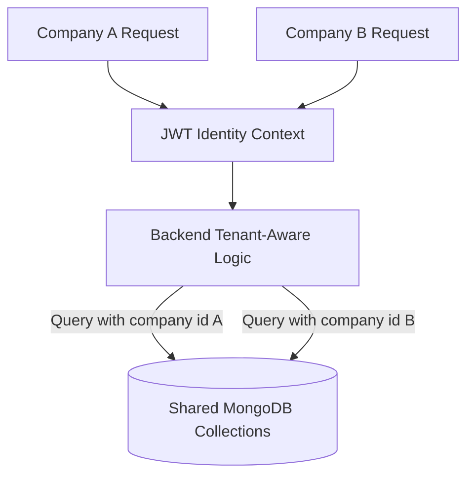

## Explanation

Multi-tenancy is enforced by deriving the tenant identity from a verified JWT, not from client-provided request fields.

Every protected route must use `req.company.id` as the trusted tenant context.

---

# 12. Deployment Architecture

The deployment architecture separates edge execution, backend execution, and database persistence.

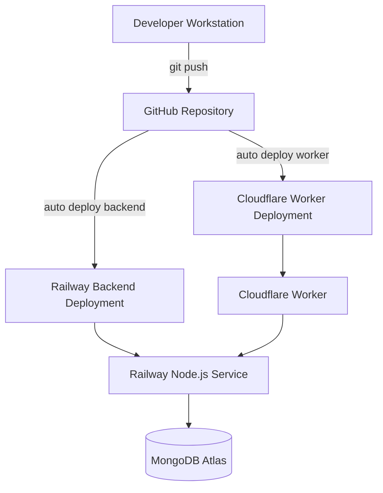

## Explanation

The system follows a Git-driven deployment model.

- Worker updates are deployed through Cloudflare integration.
- Backend updates are deployed through Railway.
- MongoDB Atlas remains managed and independent.

This improves reproducibility, auditability, and rollback capability.

---

# 13. Production Runtime Deployment

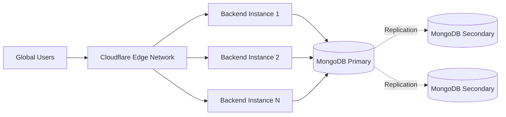

## Explanation

The backend is stateless and can be scaled horizontally.  
MongoDB Atlas provides persistence, replication, and managed availability.

---

# 14. Observability Architecture

Observability is divided into logs, metrics, traces, and audit events.

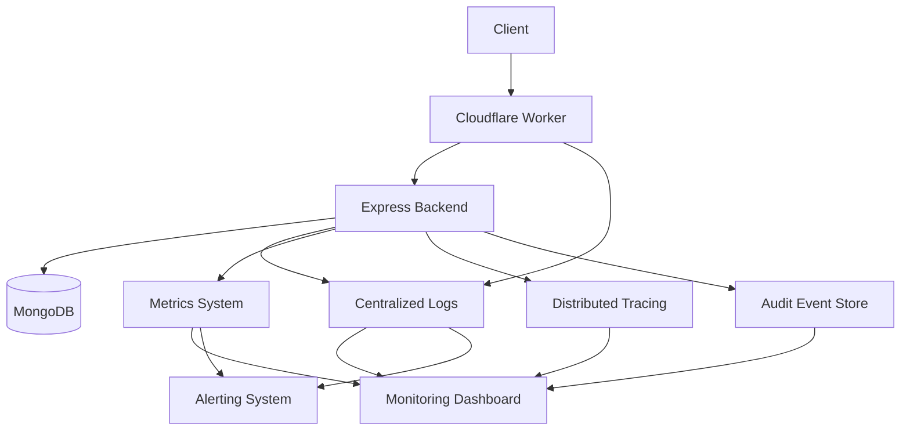

## Explanation

Observability allows operators to answer:

- What happened?
- Where did it happen?
- How long did it take?
- Was the request legitimate?
- Was the failure caused by client, edge, backend, or database?

Audit events are especially important for attendance and security-sensitive operations.

---

# 15. Logging Flow

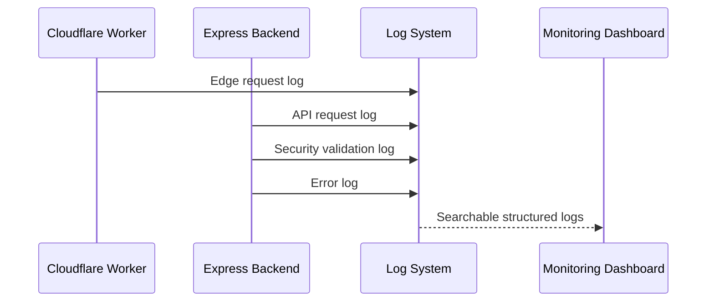

## Explanation

Logs should be structured and avoid leaking secrets.  
Sensitive values such as JWTs, passwords, HMAC keys, and EDGE_SECRET must never be logged.

---

# 16. Metrics Flow

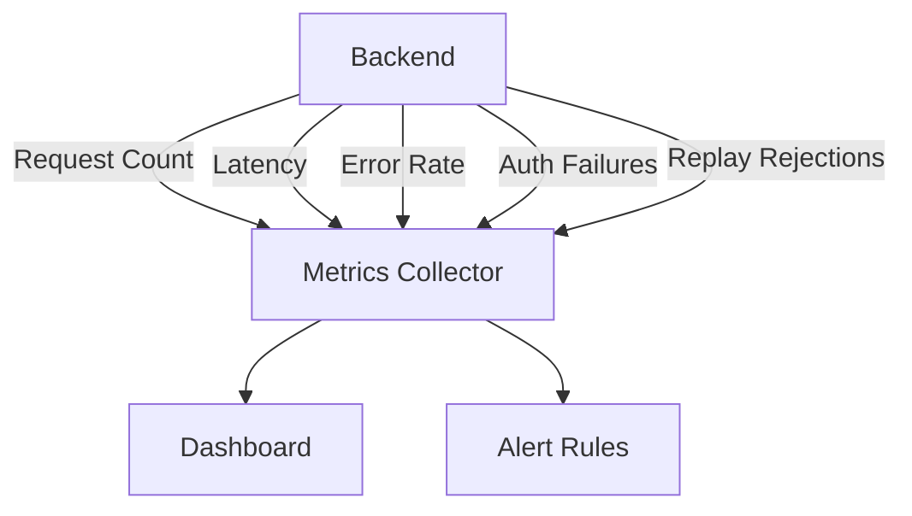

## Explanation

Important production metrics include:

- Request rate.
- Error rate.
- Authentication failure rate.
- Signature verification failure rate.
- Replay rejection count.
- Database latency.
- Worker-to-backend latency.

---

# 17. Audit Logging Architecture

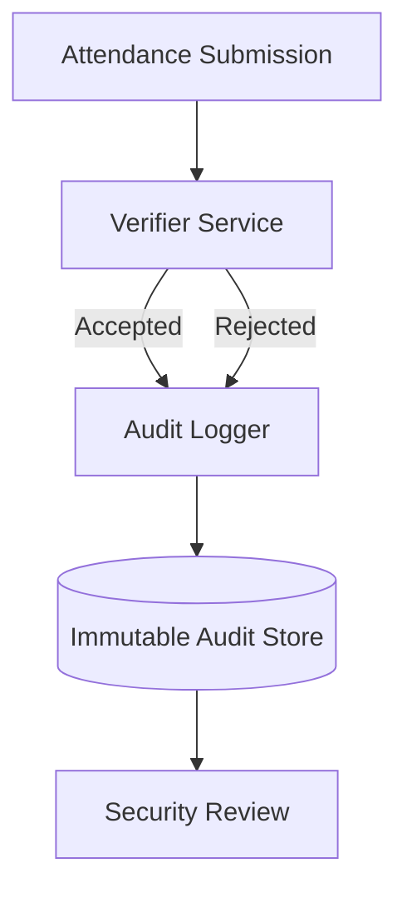

## Explanation

Audit logs should record security-relevant events such as:

- Nonce issuance.
- Attendance acceptance.
- Attendance rejection.
- Replay detection.
- Invalid signature detection.
- Gateway validation failures.

Audit logs should be append-only where possible.

---

# 18. Failure and Resilience Architecture

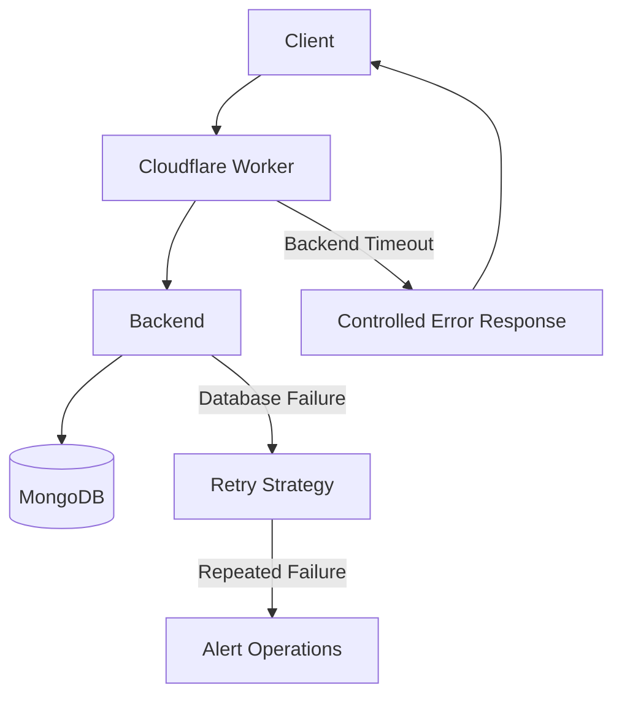

## Explanation

The Worker should fail fast when the backend is unavailable.  
The backend should return controlled errors instead of exposing stack traces.  
Repeated failures should trigger alerting.

---

# 19. Threat Model Overview

| Threat | Description | Mitigation |
|---|---|---|
| Direct backend access | Attacker bypasses Worker and calls Railway URL directly | EDGE_SECRET validation rejects requests without trusted edge header |
| Replay attack | Attacker reuses a previously valid signed request | Nonce expiration and replay store prevent reuse |
| Payload tampering | Attacker modifies location, timestamp, or identity data | HMAC signature verification detects mutation |
| Token forgery | Attacker attempts to create fake JWT | JWT secret and signature validation prevent forged tokens |
| Credential stuffing | Automated login attempts using leaked credentials | Login attempt tracking, lockout policy, and future rate limiting |
| Cross-tenant access | One tenant attempts to access another tenant's data | Tenant identity is derived from verified JWT |
| Secret leakage | Operational secret is accidentally exposed | Secret rotation and environment variable isolation |
| Database outage | Backend cannot access MongoDB | Controlled failure handling and alerting |
| Worker outage | Edge gateway cannot route traffic | Cloudflare managed availability and operational alerts |

---

# 20. Security Control Matrix

| Control | Purpose | System Location |
|---|---|---|
| HTTPS | Transport encryption | Client to Worker to Backend |
| EDGE_SECRET | Origin protection | Worker and Backend |
| JWT | Identity verification | Auth middleware |
| bcrypt | Password protection | Auth routes |
| HMAC | Payload integrity | Crypto utility and verifier |
| Nonce | Request freshness | Nonce service |
| Replay store | Replay prevention | Replay store |
| Helmet | Security headers | Express middleware |
| CORS | Controlled cross-origin access | Express middleware |
| Audit logs | Security accountability | Observability layer |

---

# 21. Final System Summary

Attendify is designed as a secure, distributed, cloud-native SaaS architecture with:

- Edge-protected backend access.
- Stateless JWT authentication.
- Cryptographic request verification.
- Nonce-based replay prevention.
- Multi-tenant isolation.
- Git-driven deployment.
- Production observability foundations.
- Horizontal scalability readiness.

---

# 22. Final Architecture Identity

```text
Attendify = Edge Gateway + Secure Identity Layer + Cryptographic Verification Engine + Multi-Tenant SaaS Backend
```

---

# 🏁 END OF DOCUMENT